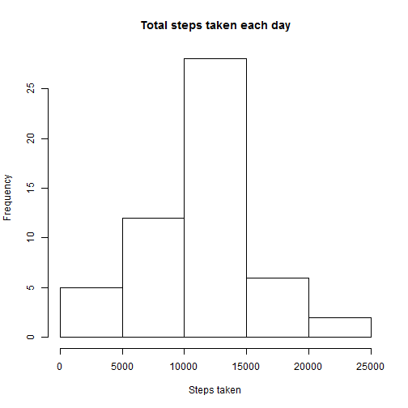
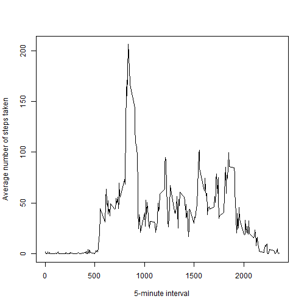
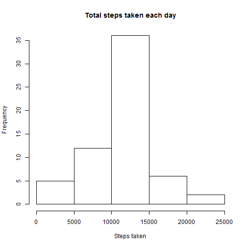

# Reproducible Research: Peer Assessment 1


## Loading and preprocessing the data

```r
act <- data.frame(read.csv("G:/DataScience/Coursera/data/activity.csv", na.strings = c("NA", 
    "NaN", " ")))
act[, 1] <- as.numeric(act[, 1])
act[, 3] <- as.numeric(act[, 3])
act[, 2] <- as.Date(act[, 2])
library(plyr)
stepsPerDay <- ddply(act, .(date), summarize, steps = sum(steps))
```


## What is mean total number of steps taken per day?

```r
hist(stepsPerDay$steps, main = "Total steps taken each day", xlab = "Steps taken")
```

 

Mean and median total number of steps taken per day are 

```r

summary(stepsPerDay)[3, 2]
```

```
## [1] "Median :10765  "
```

```r
summary(stepsPerDay)[4, 2]
```

```
## [1] "Mean   :10766  "
```

## What is the average daily activity pattern?

```r

stepsPerInterval <- ddply(act, .(interval), summarize, steps = mean(steps, na.rm = T))

with(stepsPerInterval, plot(interval, steps, type = "l", ylab = "Average number of steps taken", 
    xlab = "5-minute interval"))
```

 

Interval with maximum number of steps

```r
x <- stepsPerInterval[which(stepsPerInterval$steps == max(stepsPerInterval$steps)), 
    ]
x$interval
```

```
## [1] 835
```


## Imputing missing values
Number of rows with NAs

```r
good <- complete.cases(act)
nrow(act[!good, ])
```

```
## [1] 2304
```

Startegy selected is to replace missing values with mean for that 5 minutes interval.


```r
for (i in 1:nrow(act[!good, ])) {
    val <- act[!good, ][[3]][[i]]
    z <- stepsPerInterval[which(stepsPerInterval$interval == val), ]
    act[!good, ][[1]][[i]] <- z$steps
}
```

Total number of steps taken each day


```r
newStepsPerDay <- ddply(act, .(date), summarize, steps = sum(steps))
hist(newStepsPerDay$steps, main = "Total steps taken each day", xlab = "Steps taken")
```

 

```r
summary(newStepsPerDay)[3, 2]
```

```
## [1] "Median :10766  "
```

```r
summary(newStepsPerDay)[4, 2]
```

```
## [1] "Mean   :10766  "
```

As we have replaced NA values with mean values, the mean value has not changed. However median is a shifted since the number of values has increased and there is a new median value.  


## Are there differences in activity patterns between weekdays and weekends?


```r
act$day <- weekdays(as.Date(act$date))
for (i in 1:nrow(act)) {
    if (act[i, 4] %in% c("Monday", "Tuesday", "Wednesday", "Thursday", "Friday")) {
        act[i, 4] <- "weekday"
    } else {
        act[i, 4] <- "weekend"
    }
}
newStepsPerInterval <- ddply(act, .(interval, day), summarize, steps = mean(steps, 
    na.rm = T))
newStepsPerInterval <- transform(newStepsPerInterval, day = factor(day))
library(lattice)
xyplot(steps ~ interval | day, data = newStepsPerInterval, type = "l", ylab = "Number of steps", 
    xlab = "Interval", layout = c(1, 2))
```

 

Yes, there are differences in activity patterns between weekdays and weekends.
